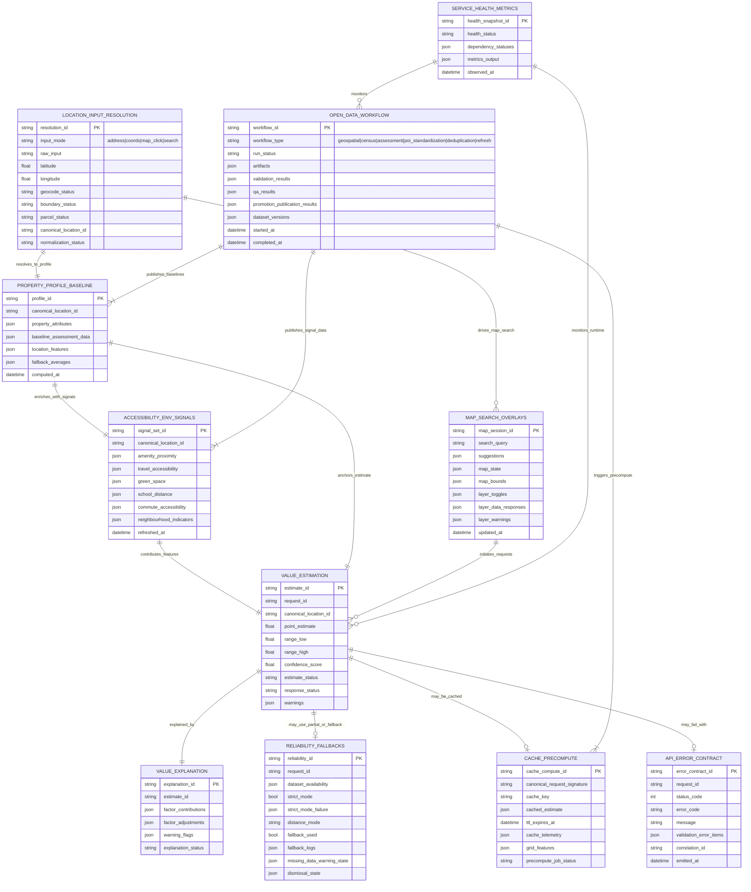

# System ER Diagram (Collapsed Collective Model)

## Coverage Mapping (spec folders -> collapsed entities)

- `001, 002, 003, 004, 024` -> `LOCATION_INPUT_RESOLUTION` and `MAP_SEARCH_OVERLAYS`
- `005, 006` -> `PROPERTY_PROFILE_BASELINE`
- `013, 014, 023` -> `VALUE_ESTIMATION`
- `015, 016` -> `VALUE_EXPLANATION` and `VALUE_ESTIMATION`
- `007, 008, 009, 010, 011, 012` -> `ACCESSIBILITY_ENV_SIGNALS`
- `017, 018, 019, 020, 021, 022` -> `OPEN_DATA_WORKFLOW`
- `029, 030` -> `CACHE_PRECOMPUTE`
- `026, 027, 028` -> `RELIABILITY_FALLBACKS`
- `031` -> `SERVICE_HEALTH_METRICS`
- `032` (+ error parts of `023`) -> `API_ERROR_CONTRACT`
